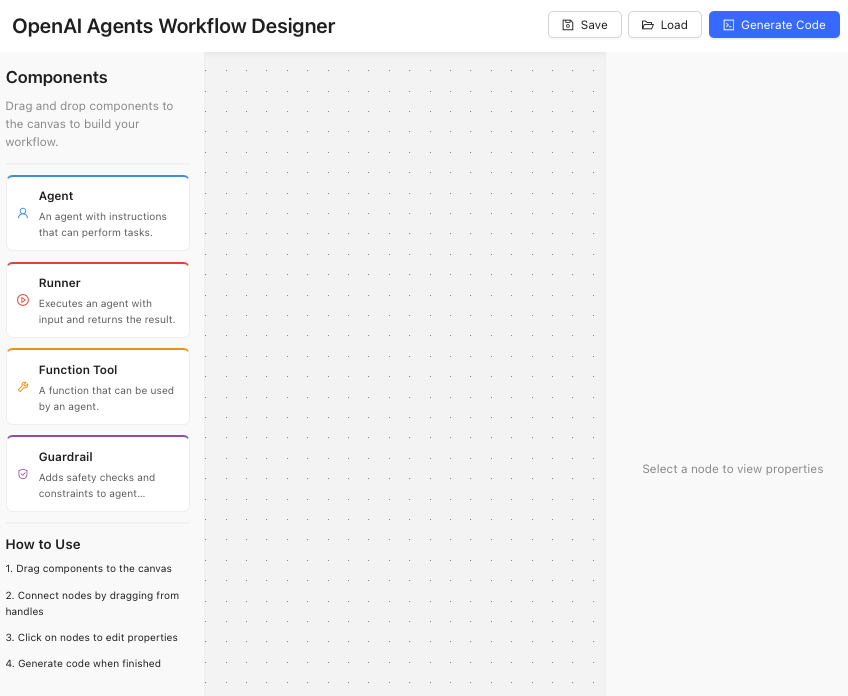
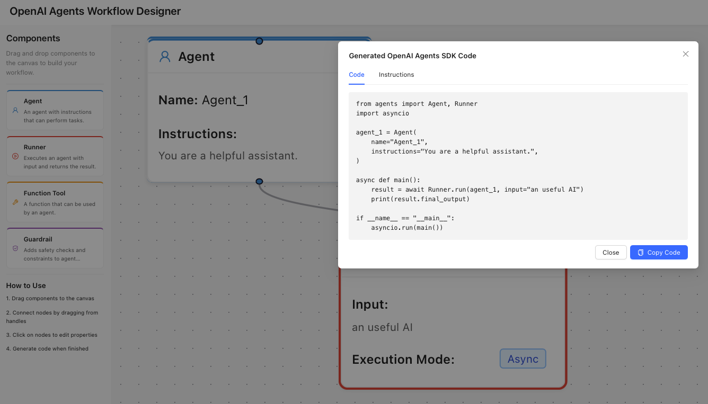

# OpenAI Agents Workflow Designer

A web-based visual editor for creating OpenAI Agents workflows through a drag-and-drop interface, allowing you to generate corresponding Python code for the OpenAI Agents SDK. This project is replicate/learning from AI超元域.




## Overview

This project provides a visual interface for designing complex agent workflows using OpenAI's Agents framework. It aims to simplify the process of creating and configuring agent systems without writing code directly. Once your workflow is designed, you can generate Python code compatible with the OpenAI Agents SDK.

## Features

- **Visual Workflow Editor**: Design your agent system visually with a drag-and-drop interface
- **Component Types**:
  - Agent nodes (blue) - Define agents with instructions, handoffs, and tools
  - Runner nodes (red) - Execute agents with specified input and context
  - Function Tool nodes (yellow) - Define tools that agents can use
  - Guardrail nodes (purple) - Implement safety checks and constraints
- **Real-time Properties Editor**: Configure each component's properties through a user-friendly panel
- **Code Generation**: Generate Python code that implements your designed workflow
- **Save & Load**: (Coming soon) Save your workflows and load them later

## Getting Started

### Prerequisites

- Node.js (v18 or later recommended)
- npm (v9 or later recommended)
- Python 3.11+ (for running the generated code)

### Installation

1. Clone this repository:
   ```bash
   git clone https://github.com/chennanli/openai-agents-workflow-designer.git
   cd openai-agents-workflow-designer
   ```

2. Install frontend dependencies:
   ```bash
   cd agent-workflow-designer
   npm install
   ```

3. Start the development server:
   ```bash
   npm run dev
   ```

4. Open http://localhost:5173/ in your browser

### Using the Application

1. **Build your workflow**:
   - Drag components from the left sidebar to the canvas
   - Connect nodes by dragging from one node's handle to another
   - Click on nodes to edit their properties in the right panel

2. **Generate code**:
   - Click the "Generate Code" button in the top navigation bar
   - Review the generated code in the modal
   - Copy the code or download it

3. **Run the generated code**:
   - Install dependencies: `pip install -r requirements.txt`
   - Set your OpenAI API key: `export OPENAI_API_KEY=your_api_key_here`
   - Run your generated Python code

## Project Structure

```
agent-workflow-designer/
├── public/              # Static assets
├── src/
│   ├── components/
│   │   ├── nodes/       # Node component definitions
│   │   ├── panels/      # UI panels (sidebar, properties)
│   │   └── modals/      # Modal components
│   ├── context/         # React context for state management
│   ├── types/           # TypeScript type definitions
│   ├── App.tsx          # Main application component
│   └── main.tsx         # Entry point
├── package.json         # Dependencies and scripts
└── vite.config.ts       # Vite configuration
```

## Running the Generated Code

The code generated by this tool is compatible with the OpenAI Agents SDK. To use it:

1. Make sure you have the OpenAI Agents SDK installed:
   ```bash
   pip install -r requirements.txt
   ```

2. Save the generated code to a Python file

3. Set your OpenAI API key:
   ```bash
   export OPENAI_API_KEY=your_api_key_here
   ```

4. Run the Python file:
   ```bash
   python your_workflow.py
   ```

## Contributing

Contributions are welcome! Please feel free to submit a Pull Request.

## License

This project is licensed under the MIT License - see the LICENSE file for details.
